# Evaluation report

Generated 2026-09-17 from the files in `results/`.
Model `openai/clip-vit-base-patch32` at revision `3d74acf9a28c`,
dataset `jxie/flickr8k` at `56f58c967835`.

Every number below is read from a committed result file. Nothing is typed in
by hand, so the report cannot drift away from the runs that produced it.

---

## The human ceiling

Each image carries five captions written independently by five people.
Measured rather than spent as five times more training text, that
redundancy says how ambiguous the task itself is -- and therefore how
well any model could possibly do.

| Measure | Value |
|---|---|
| Mean pairwise Jaccard | 0.217 |
| Mean subject consensus | 0.823 |
| All five share a subject | 43.7% |
| No majority subject | 5.3% |
| Caption length | 11.8 words |

The distance between 0.217 and 0.823 is the finding: annotators reuse very
little of each other's vocabulary while agreeing on the subject far more
often than not. That is the case for a shared embedding space over lexical
matching, stated in the data before any model is involved.

## The embedding space

| Comparison | Mean cosine similarity |
|---|---|
| image vs image (random pairs) | 0.5200 |
| image vs its own captions | 0.3194 |
| image vs random captions | 0.1681 |
| **alignment gap** | **+0.1513** |

Two unrelated images already score 0.52. CLIP's vectors
occupy a narrow cone rather than the whole sphere, so an absolute similarity
carries almost no information -- only the ranking, and the gap above the
baseline, do. Image-image and image-text scores also sit on different scales
and are not comparable to each other.

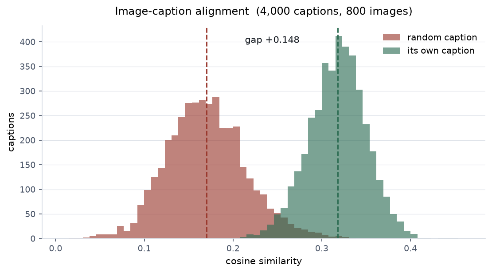

## Text-to-image retrieval

51 queries against all 8,000 images. The queries are
rewritten from held-out captions rather than copied: a query that is verbatim
a caption in the index tests string matching dressed up as semantic search.

| Metric | Value |
|---|---|
| Recall@1 | 0.118 |
| Recall@5 | 0.431 |
| Recall@10 | 0.569 |
| MRR | 0.261 |
| Median rank | 7 |
| Worst rank | 1,671 |

### Recall@1 is misleading here, and by how much

A retrieval metric assumes one correct answer per query. Flickr8k holds
dozens of photographs of dogs catching frisbees, so a query describing one
of them matches all of them. When the model returns a *different* frisbee
dog than the designated gold image, Recall@1 records a miss although the
model did what was asked.

Of the 45 queries that did not rank the gold image first,
**20** returned an image scoring at least 0.75 against the gold image -- well above the 0.52 two random images score, i.e. plainly the same
kind of photograph.

| | Recall@1 |
|---|---|
| As measured | 0.118 |
| Crediting same-scene returns | 0.510 |

Neither number alone is honest. The first understates the system, the
second is generous about what counts as correct, and the true figure sits
between them -- which is why both are reported.

### By query type

One averaged recall hides which kinds of language the model cannot handle.

| Type | n | R@1 | R@5 | R@10 | MRR | Median rank |
|---|---|---|---|---|---|---|
| attribute | 8 | 0.25 | 0.75 | 0.88 | 0.473 | 2 |
| object | 8 | 0.00 | 0.62 | 0.75 | 0.247 | 5 |
| counting | 7 | 0.00 | 0.71 | 0.71 | 0.244 | 4 |
| scene | 7 | 0.29 | 0.43 | 0.57 | 0.355 | 6 |
| spatial | 6 | 0.17 | 0.33 | 0.50 | 0.281 | 16 |
| compositional | 6 | 0.00 | 0.00 | 0.33 | 0.071 | 18 |
| action | 9 | 0.11 | 0.11 | 0.22 | 0.139 | 30 |

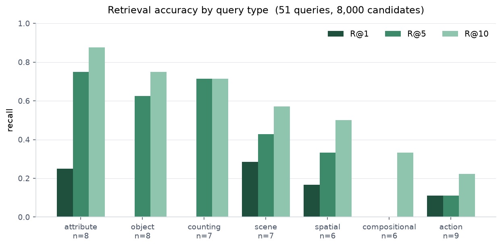

## Hard negatives

Retrieval over 8,000 images where only a handful are even vaguely relevant
is not a demanding test: the model can find the right dog photograph in a
corpus of mostly beaches by recognising "dog". The harder question is what
happens when every candidate is a dog photograph.

12 groups of near-identical images were found by clustering the
embeddings (mean size 8.17, mean within-group similarity
0.8679), and a query was written by hand for one member of each.

| Setting | Recall@1 |
|---|---|
| Inside the group (8.17 candidates) | 0.583 |
| Whole corpus (8,000 candidates) | 0.250 |
| **Gap** | **+0.333** |

The within-group number is higher, which is the opposite of what "hard"
usually implies, and the reason is worth stating: restricting the candidate
set removes the thousands of unrelated images that could outrank the target
by accident. What the gap measures is how much of the corpus-wide difficulty
comes from sheer volume rather than from the near-duplicates -- and at this
scale, most of it does.

## Visual question answering

100 questions written by hand over 24 held-out images, each sourced from what
the image's five annotators collectively establish rather than from one
caption's wording.

| Measure | Value |
|---|---|
| Accuracy | **0.790** |
| Exact string match only | 0.780 |
| Rescued by answer normalisation | 1 answers |
| Seconds per question (CPU) | 0.37 |

The gap between 0.790 and 0.780 is what exact string
matching would have thrown away: "two" scored against "2", "a dog" against
"dog". That is formatting, not vision, and counting it as error would
misattribute the loss.

### By question type

This is the table the repository exists for. One averaged accuracy
describes none of these categories.

| Question type | n | Accuracy | Most common wrong answer |
|---|---|---|---|
| object presence | 17 | 0.941 | `0` (x1) |
| counting | 17 | 0.882 | `4` (x1) |
| scene | 16 | 0.875 | `boat` (x1) |
| spatial | 16 | 0.875 | `0` (x2) |
| colour | 17 | 0.765 | `brown` (x2) |
| action | 17 | 0.412 | `talking on phone` (x1) |

On binary questions the gold answer is yes 97% of the time and the model
answers yes 88% of the time. A model that simply always said yes would
score 97% on them, so that comparison is what separates seeing from
guessing.

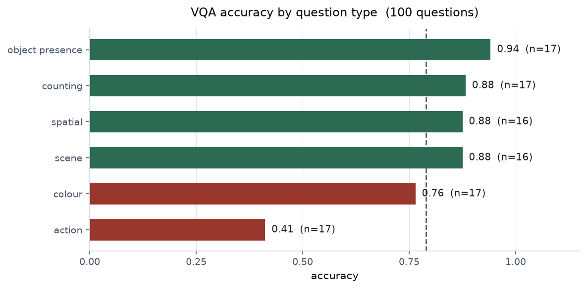

## Where retrieval fails, and why

25 queries failed for real -- that is, the image the model
returned was not merely a different photograph of the same thing. Reading them
together, they are not 25 unrelated accidents.

On average a failed query's returned image supports only **34%** of the query's content words.

| Pattern | n | What it means |
|---|---|---|
| fragment match | 12 | the returned image supports a minority of the query's words |
| constraint dropped | 9 | the head noun matched but its modifiers were ignored |
| vocabulary gap | 4 | a query word appears in no caption in this corpus |

**Fragment match** is the largest group and the most characteristic. CLIP
compresses an entire query into one 512-dimensional vector *before* it sees any
photograph, so a query carrying five constraints arrives as a blur of all five.
The nearest image is then whichever one matches the strongest surviving concept.

**Constraint dropped** is the same mechanism in a milder form: the head noun
survives compression and its modifiers do not. "A rowing boat on open blue
water" returns a motorboat on a waterway -- boat, water and blue are all
present, and nothing in a single vector can say that "rowing" modifies
"boat".

**Vocabulary gap** is not a model failure and is reported separately for that
reason. The query said *crimson*; no caption in this corpus uses that word, so
there was no caption evidence to rank against. CLIP knows the word perfectly
well -- it returned a girl in a red shirt who is skating, which is substantially
correct. This is the cost of Phase 4's decision to rewrite queries rather than
copy captions, and it is worth seeing rather than hiding.

## Worked failure cases

An accuracy table says how often the system is wrong. These say what being
wrong looks like, which is what decides whether it is usable for a given
problem.

### Retrieval — fragment match

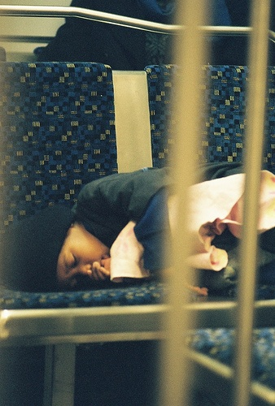

| | |
|---|---|
| **Asked** | a child asleep stretched across two chairs |
| **Expected** | test_00460 at rank 1 |
| **Produced** | train_04232 at rank 1; gold at rank 26 |

*Captions:* A child in a black cap sleeping across two chairs .

The query carries five constraints -- a child, asleep, stretched, across, two chairs -- and the returned image supports none of them. CLIP compresses the whole sentence into one 512-dimensional vector before it sees any photograph, and a vector that must simultaneously encode a posture, a count, a spatial relation and a piece of furniture ends up encoding none of them strongly. The nearest image is one that is vaguely about small children, which is what survives the compression.

### Retrieval — fragment match

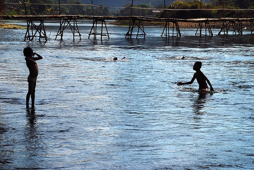

| | |
|---|---|
| **Asked** | four or more swimmers heading toward a bridge |
| **Expected** | test_00783 at rank 1 |
| **Produced** | train_00252 at rank 1; gold at rank 39 |

*Captions:* At least 4 people swim in shallow water that grows deeps towards a bridge .

"Four or more" is a quantity expressed as a range, and CLIP has no mechanism for either part: not for the exact count, and not for the comparison. What reaches the embedding is roughly "swimmers", so the model returns children in a pool. The Phase 5 contrast is the point here: BLIP answers counting questions at 0.88 on the same images, because it holds the question while looking rather than compressing it first.

### Retrieval — vocabulary gap

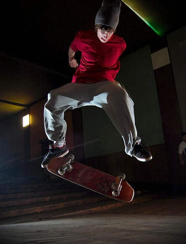

| | |
|---|---|
| **Asked** | a skateboarder wearing a crimson top |
| **Expected** | test_00194 at rank 1 |
| **Produced** | train_02338 at rank 1; gold at rank 2 |

*Captions:* A man in a red shirt is doing a trick with his skateboard .

The query says crimson; every caption in the corpus that describes this colour says red. The model returned a girl in a red shirt who is skating -- which is, in substance, exactly right. This is not a model failure but a gap between the evaluation vocabulary and the corpus vocabulary, introduced by Phase 4's decision to rewrite queries rather than copy captions. That decision was correct and this is its cost, visible.

### Retrieval — constraint dropped

| | |
|---|---|
| **Asked** | a rowing boat on open blue water |
| **Expected** | test_00789 at rank 1 |
| **Produced** | train_03347 at rank 1; gold at rank 5 |

*Captions:* A man in a rowboat is rowing across blue water .

The head noun matched and the modifiers did not: the returned image is a boat on water, but a motorboat driven past apartments rather than a rowing boat on open water. "Rowing" and "open" are both adjectival constraints on "boat", and CLIP's single vector cannot express that one concept modifies another. It sees boat, water, blue -- all present -- and ranks accordingly.

### Visual QA — action

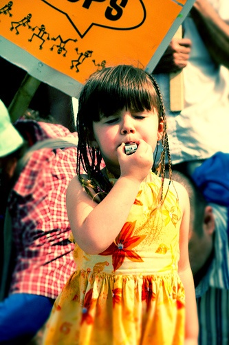

| | |
|---|---|
| **Asked** | What is the girl doing? |
| **Expected** | blowing a whistle |
| **Produced** | talking on phone |

*Captions:* A girl blows a whistle .

The model answered "talking on phone" for a girl blowing a whistle. Looking at the photograph explains it: the whistle is small, silver, and almost entirely hidden behind her fingers, and her hand is raised to her face in exactly the posture of someone holding a phone. The visible evidence -- a small bright object, a raised hand, a face turned toward it -- is genuinely shared between the two acts, and phones outnumber whistles in web training data by orders of magnitude. This is a prior overwhelming weak evidence rather than a perception error, and it recurs on a second image, which is what makes it a pattern.

### Visual QA — action

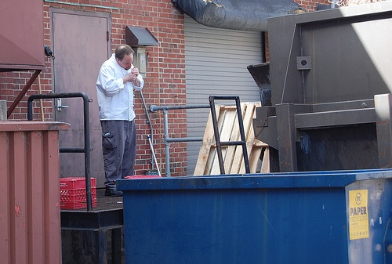

| | |
|---|---|
| **Asked** | What is the man doing? |
| **Expected** | smoking |
| **Produced** | looking at phone |

*Captions:* A man in a white restaraunt shirt smokes next to a dumpster .

The second instance of the same failure, which is what makes it a pattern rather than an accident. A man lighting a cigarette becomes "looking at phone". Both cases involve a small object near the face, and in both the model reaches for the commonest explanation for that configuration in its training distribution. A product built on this would misreport smoking as phone use consistently, not occasionally.

### Visual QA — counting

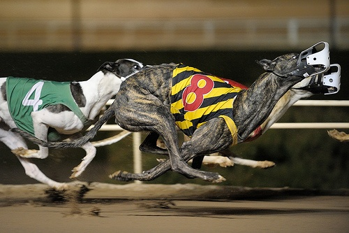

| | |
|---|---|
| **Asked** | How many dogs are racing? |
| **Expected** | 3 |
| **Produced** | 2 |

*Captions:* A group of dogs racing .

Every counting question with a gold answer of 1 or 2 was answered correctly -- fourteen of fourteen. Both errors are at 3, and both are off by exactly one. The model is not guessing: it is estimating, and its estimate degrades in a specific, bounded way as the count rises. That distinction matters for whether the capability is usable: "reliable up to two, approximate above" is a specification, where "0.88 accurate" is not.

### Visual QA — colour

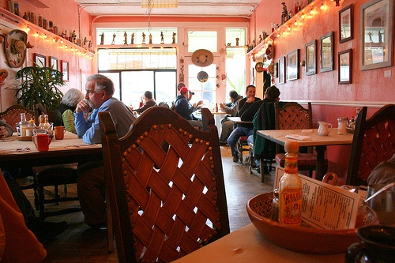

| | |
|---|---|
| **Asked** | What colour are the chairs? |
| **Expected** | red |
| **Produced** | brown |

*Captions:* An empty seat at a Mexican themed restaurant .

Red was read as brown twice, on different images and different objects (these restaurant chairs, and a boy's vest). A single colour error would be noise; the same confusion twice out of four colour errors is a systematic bias. The image shows why it is a defensible one: the chairs are stained wood under warm low restaurant lighting, and their pixels sit genuinely between red and brown. Five annotators called them red because they had the scene -- a red-walled Mexican restaurant -- to read the colour against. The model has only the pixels, and the pixels are ambiguous.

## Latency

100 queries, k=10, 8,000 images, 12 CPU threads.

| Stage | p50 | p95 | p99 |
|---|---|---|---|
| Text encode | 6.80 ms | 8.94 ms | 9.59 ms |
| Index search | 0.59 ms | 0.72 ms | 0.81 ms |
| **End to end** | **7.44 ms** | **9.53 ms** | 10.20 ms |

Text encoding is 92% of a query. The dot product over 8,000 vectors
is the cheap half, which is why an approximate index would buy nothing at
this scale. Model and index load in 5.8s, once at startup.

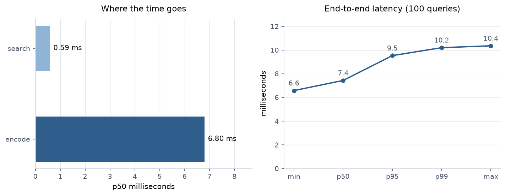
